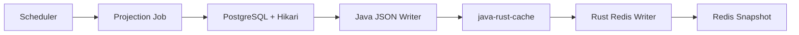
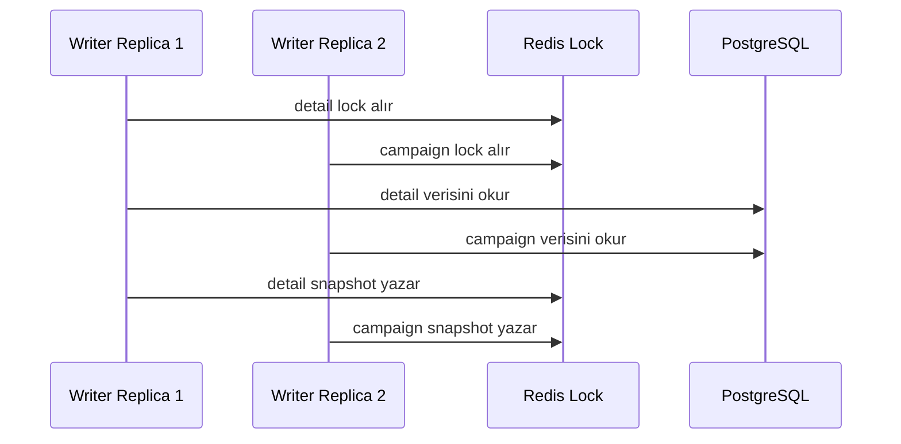

# rest-sample-cache-writer Kullanıcı Rehberi

Bu rehber ilk kullanım içindir.

Amaç kısa ve nettir: PostgreSQL'den veriyi okuyup Redis'e hazır JSON snapshot olarak yazmak.

## İçindekiler

1. [Bu Proje Ne İşe Yarar?](#bu-proje-ne-işe-yarar)
2. [Akış Nasıl Çalışır?](#akış-nasıl-çalışır)
3. [Ne Zaman Kullanılır?](#ne-zaman-kullanılır)
4. [Gerçek Hayat Senaryoları](#gerçek-hayat-senaryoları)
5. [Hızlı Başlangıç](#hızlı-başlangıç)
6. [Kopyala-Yapıştır Örnekler](#kopyala-yapıştır-örnekler)
7. [Projection Mantığı](#projection-mantığı)
8. [Önemli Ayarlar](#önemli-ayarlar)
9. [TTL Ve Refresh Kuralı](#ttl-ve-refresh-kuralı)
10. [İki Replica Nasıl Davranır?](#iki-replica-nasıl-davranır)
11. [Sık Hatalar](#sık-hatalar)

## Bu Proje Ne İşe Yarar?

`rest-sample-cache-writer`, DB verisini Redis read model'e çeviren örnektir.

REST endpoint açmaz. Dubbo kullanmaz.

DB okuma Java tarafındadır. Redis yazma `java-rust-cache` ile Rust tarafındadır.

## Akış Nasıl Çalışır?



Writer snapshot üretir. Reader bu snapshot'ı okur.

Bu ayrım read-heavy sistemlerde DB'yi hot path dışına çıkarır.

## Ne Zaman Kullanılır?

| Senaryo | Bu proje uygun mu? | Neden |
|---------|--------------------|-------|
| DB'den read model üretilecek | Evet | Projection bazlı snapshot yazar. |
| REST API açılacak | Hayır | Bu proje HTTP server değildir. |
| Çok replica çalışacak | Evet | Projection bazlı lock vardır. |
| Her request'te DB query isteniyor | Hayır | Bu proje cache materializer'dır. |
| Redis Cluster veya Sentinel kullanılacak | Evet | `java-rust-cache` destekler. |

## Gerçek Hayat Senaryoları

| Senaryo | Ne yapılır? | Önerilen projection |
|---------|-------------|---------------------|
| Müşteri detay ekranı | Her müşteri için hazır JSON yazılır. | `detail` |
| Segment listesi | Segment bazlı index yazılır. | `segment` |
| Aktif müşteri ekranı | Status bazlı index yazılır. | `status` |
| Kampanya seçimi | Sık değişen aday listesi kısa aralıkla yenilenir. | `campaign` |
| Cache sağlık bilgisi | Son snapshot zamanı ve sayaçlar yazılır. | `meta` |

Bu projede amaç API request anında DB yükünü azaltmaktır.

Writer DB'yi kontrollü aralıklarla okur. Reader ise Redis'ten hızlı cevap verir.

## Hızlı Başlangıç

PostgreSQL ve Redis'i hazırlayın.

Sonra writer'ı çalıştırın:

```powershell
mvn -q package
java -jar target/rest-sample-cache-writer-0.4.0.jar
```

Tek seferlik snapshot için:

```powershell
java "-Dsample.writer.run-once=true" -jar target/rest-sample-cache-writer-0.4.0.jar
```

## Kopyala-Yapıştır Örnekler

Sadece tek seferlik snapshot üret:

```powershell
java "-Dsample.writer.run-once=true" `
  "-Dsample.writer.projections=detail,segment,meta" `
  -jar target/rest-sample-cache-writer-0.4.0.jar
```

Kampanya projection'ını daha sık yenile:

```properties
sample.writer.campaign.interval-ms=30000
sample.writer.campaign.cache-ttl-ms=120000
```

Segment ve status projection'larını daha seyrek yenile:

```properties
sample.writer.segment.interval-ms=120000
sample.writer.segment.cache-ttl-ms=300000
sample.writer.status.interval-ms=120000
sample.writer.status.cache-ttl-ms=300000
```

Production'da schema init kapat:

```properties
sample.db.schema-init=false
sample.db.maximum-pool-size=2
sample.db.minimum-idle=0
```

Redis Sentinel örneği:

```properties
reactor.cache.redis.topology=sentinel
reactor.cache.redis.nodes=redis-sentinel-0.redis:26379,redis-sentinel-1.redis:26379,redis-sentinel-2.redis:26379
reactor.cache.redis.sentinel.master-name=mymaster
```

## Projection Mantığı

Projection, Redis'e yazılan ayrı bir read model parçasıdır.

| Projection | Ne üretir? | Örnek kullanım |
|------------|------------|----------------|
| `detail` | Customer detail ve customerNo index | `GET /customers/{id}` |
| `segment` | Segment bazlı liste | Segment ekranı |
| `status` | Status bazlı liste | Aktif/pasif müşteri ekranı |
| `campaign` | Kampanya aday listesi | Kampanya seçimi |
| `meta` | Snapshot bilgisi | Cache hazır mı kontrolü |

Her projection kendi interval, TTL ve lock değerine sahip olabilir.

## Önemli Ayarlar

| Property | Ne işe yarar? | Ne zaman değiştirilir? |
|----------|---------------|------------------------|
| `sample.writer.projections=detail,segment,status,campaign,meta` | Çalışacak projection listesidir. | Sadece ihtiyacınız olan read model'leri bırakın. |
| `sample.writer.interval-ms=60000` | Varsayılan yenileme aralığıdır. | Tüm projection'lar aynı sıklıkta yenilenecekse kullanın. |
| `sample.writer.detail.interval-ms` | Sadece `detail` projection aralığıdır. | Projection bazlı zamanlama istiyorsanız kullanın. |
| `sample.writer.detail.cache-ttl-ms` | `detail` verisinin Redis TTL değeridir. | Her zaman interval değerinden uzun olmalıdır. |
| `sample.writer.scheduler-threads=2` | Aynı anda kaç projection job çalışabilir. | Replica ve DB kapasitesine göre küçük tutun. |
| `sample.writer.lock-ttl-ms=300000` | Redis lock yaşam süresidir. | Job süresinden uzun olmalıdır. |
| `sample.db.maximum-pool-size=2` | Hikari DB connection üst limitidir. | DB kapasitesi ölçülmeden artırılmamalıdır. |

## TTL Ve Refresh Kuralı

TTL her zaman refresh interval değerinden uzun olmalıdır.

| Örnek | Doğru mu? | Neden |
|-------|-----------|-------|
| `interval=60000`, `ttl=300000` | Evet | Yeni snapshot gelmeden eski veri silinmez. |
| `interval=120000`, `ttl=60000` | Hayır | Reader kısa süre cache miss görebilir. |
| `campaign interval=30000`, `ttl=120000` | Evet | Sık değişen veri için güvenli pencere bırakır. |

Kural basittir:

```text
cache-ttl-ms > interval-ms + güvenlik payı
```

Güvenlik payı için `sample.writer.cache-ttl-safety-margin-ms` kullanılır.

## İki Replica Nasıl Davranır?



İki replica aynı projection'ı aynı anda yazmaz.

Farklı projection'lar aynı anda farklı replica üzerinde çalışabilir.

## Sık Hatalar

| Belirti | Muhtemel neden | Çözüm |
|---------|----------------|-------|
| TTL uyarısı | TTL, interval değerinden kısa. | TTL değerini interval değerinden uzun yapın. |
| Lock alınamadı | Başka replica aynı projection'ı yazıyor. | Bu normaldir. Logları kontrol edin. |
| DB yavaşlıyor | Scheduler thread veya Hikari pool fazla. | `scheduler-threads` ve `maximum-pool-size` düşürün. |
| Reader `cache_not_ready` dönüyor | Writer henüz snapshot yazmadı. | Writer loglarında projection publish satırlarını kontrol edin. |
